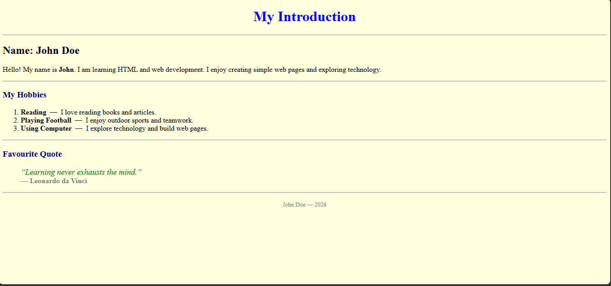

# 01 HTML Structure – Personal Introduction Page

## 📖 About This Project

This project is created for **beginner learners to practice basic HTML structure and simple webpage design**.

It is a **Personal Introduction Page** built using **only pure HTML**.
The page displays a short introduction, hobbies, and a favorite quote.

There is:

❌ No CSS
❌ No JavaScript
❌ No Bootstrap
❌ No Backend

The purpose of this project is to help beginners understand **how a basic webpage is structured using HTML tags**.

---

## 🎯 Learning Objectives

After completing this project, learners will understand:

* Basic HTML page structure
* `<html>`, `<head>`, and `<body>` tags
* Headings and paragraphs
* Ordered lists
* Text formatting using `<b>`, `<i>`, and ``
* Page background color using `bgcolor`
* Text alignment using `align`
* Adding quotes using `<blockquote>`
* Creating simple webpage sections using `
`

---

## 🖥 Full Design Information

This project includes a **simple beginner-level webpage design** with the following sections:

* Page title
* Background color
* Center aligned main heading
* Personal introduction section
* Hobbies list
* Favourite quote section
* Author footer

The page demonstrates how a **simple personal webpage can be created using only HTML tags and attributes**.

---

## 🏷 HTML Tags Used and Their Purpose

| Tag                  | Purpose                              |
| -------------------- | ------------------------------------ |
| `<html>`             | Root element of the HTML page        |
| `<head>`             | Contains metadata and title          |
| `<title>`            | Displays page title in browser tab   |
| `<body>`             | Contains all visible webpage content |
| `<h1>` `<h2>` `<h3>` | Headings used for section titles     |
| `
`                | Paragraph text                       |
| `<b>`                | Makes text bold                      |
| `<i>`                | Makes text italic                    |
| ``             | Changes text color and size          |
| `<ol>`               | Creates an ordered list              |
| `<li>`               | List item inside lists               |
| `<blockquote>`       | Displays a quotation block           |
| `
`               | Creates a horizontal line            |
| ` `               | Creates a line break                 |

---

## 🚀 How to Run This HTML Page

1. Open **Visual Studio** or **Visual Studio Code**.
2. Create a new HTML file named:index.html
3. create  the HTML code into the file.
4. Save the file.
5. Double-click the file or open it in your browser.

The webpage will open and display the ** Design Page **.

---

## 📸 Output

## 💡 Purpose of This Project

This project is designed to help beginners **practice HTML fundamentals and understand how webpage content is structured** using only HTML elements.
