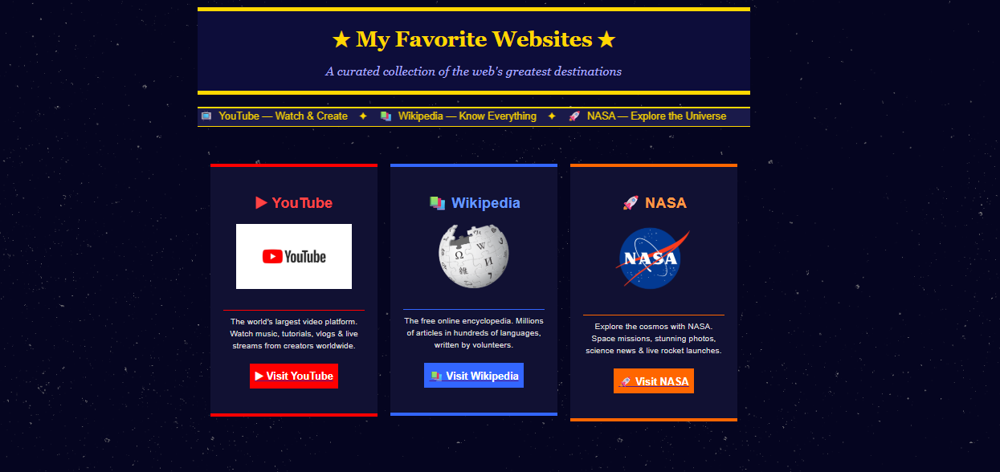

# 04 HTML Links & Images – Favorite Websites Page

## 🌐 What are Links and Images in HTML?

**Links (`<a>`)** are used to connect one webpage to another webpage or website.
**Images (``)** are used to display pictures, logos, or graphics on a webpage.

Together, they help create **interactive and visually engaging webpages**.

---

## 📖 About This Project

This project is created for **beginner learners to practice HTML links and images** while designing a simple webpage.

It is a **Favorite Websites Page** built using **only pure HTML elements**.
The page showcases a collection of popular websites with their **logos, descriptions, and clickable links**.

There is:

❌ No CSS
❌ No JavaScript
❌ No Bootstrap
❌ No Backend

The goal of this project is to help beginners understand how **links and images can be used to build informative web pages**.

---

## 🎯 Learning Objectives

After completing this project, learners will understand:

* Creating hyperlinks using `<a>`
* Opening links in a new tab using `target="_blank"`
* Displaying images using ``
* Adding image attributes like `src`, `alt`, and `width`
* Creating webpage sections using `<table>`
* Adding background images
* Creating layout structures using tables
* Using text formatting with `<font>`
* Creating simple navigation elements

---

## 🖥 Full Design Information

This project includes a **websites showcase page** with the following sections:

### Page Header

* Website title
* Decorative icons
* Subtitle

### Website Information Cards

Each card contains:

* Website name
* Website logo
* Short description
* A button-style link to visit the website

### Websites Included

1. **YouTube** – Video sharing platform
2. **Wikipedia** – Online encyclopedia
3. **NASA** – Space exploration website

Each website is displayed inside a **card-style layout using HTML tables**.

---

## 🏷 HTML Tags Used and Their Purpose

| Icon | Tag         | Purpose                              |
| ---- | ----------- | ------------------------------------ |
| 🧱   | `<html>`    | Root element of the HTML document    |
| 🧠   | `<head>`    | Contains metadata and title          |
| 🏷   | `<title>`   | Displays page title in browser tab   |
| 📄   | `<body>`    | Contains all visible webpage content |
| 🔠   | `<h1> <h3>` | Creates headings                     |
| 📝   | `<p>`       | Defines paragraph text               |
| 🔗   | `<a>`       | Creates hyperlinks                   |
| 🖼   | ``     | Displays images                      |
| 📦   | `<table>`   | Creates layout structure             |
| 📏   | `<tr>`      | Table row                            |
| 📑   | `<td>`      | Table cell                           |
| 🎨   | `<font>`    | Changes text color, size, and font   |
| ➖    | `<hr>`      | Creates horizontal divider           |
| ↩    | `<br>`      | Adds spacing                         |
| 📢   | `<marquee>` | Creates scrolling text effect        |

---

## 🖼 How Images Are Added in This Project

Images are added using the **`` tag**.

Example:

```html

```

### Important Image Attributes

| Attribute | Purpose                                       |
| --------- | --------------------------------------------- |
| `src`     | Specifies the image file location             |
| `alt`     | Alternative text shown if image fails to load |
| `width`   | Controls image size                           |

---

## 📁 Image Folder Structure

For images to work correctly, the project should follow this folder structure:

```text
project-folder
│
├── index.html
│
└── wwwroot
     └── Images
          ├── Backgroundimage.png
          ├── youtube logo.png
          ├── Wikipedia logo.png
          └── NASA logo..png
```

---

## 🪜 Steps to Add Images to the Project

1. Create a folder named:

```text
wwwroot
```

2. Inside that folder create another folder:

```text
Images
```

3. Place all required images inside the **Images** folder.

Example images used in this project:

* Backgroundimage.png
* youtube logo.png
* Wikipedia logo.png
* NASA logo..png

4. Reference the image in HTML using the path:

```html
src="wwwroot/Images/image-name.png"
```

---

## 🌄 How the Background Image is Added

The background image is applied to the webpage using the **`background` attribute** inside the `<body>` tag.

Example:

```html
<body background="wwwroot/Images/Backgroundimage.png" bgcolor="#050520">
```

Explanation:

* `background` → sets the page background image
* `bgcolor` → fallback background color if the image does not load

---

## 🚀 How to Run This HTML Page

1. Open **Visual Studio** or **Visual Studio Code**.
2. Create a new HTML file named:

```text
index.html
```

3. Create the HTML code into the file.
4. Save the file.
5. Open the file in your browser.

The browser will display the ** Websites Page**.

## 📸 Output



## 💡 Purpose of This Project

This project helps to practice **HTML links and image handling** while designing a simple but visually structured webpage using **only basic HTML elements without CSS**.
