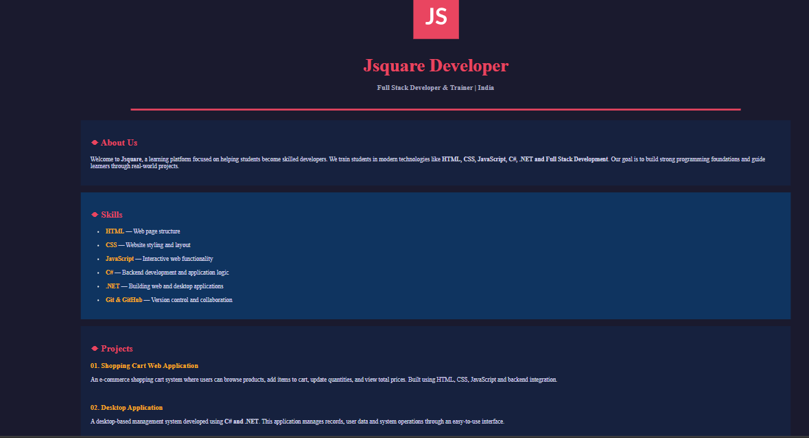

# 💼 Personal Portfolio – Simple HTML Portfolio Page

## 📌 About the Project

This project is a **Simple Personal Portfolio Website** built using **pure HTML only**.

The webpage showcases a **developer portfolio layout** including:

* Profile section
* About information
* Skills list
* Projects section
* Contact details

The design uses **tables, fonts, colors, icons, and images** to create a structured webpage **without using CSS or JavaScript**.

This project helps beginners understand how **HTML can be used to organize and display professional information on a webpage**.

---

# 🎯 Learning Objectives

After completing this project, students will learn how to:

* Build a **personal portfolio webpage**
* Structure a webpage using **HTML tags**
* Create sections like **About, Skills, Projects, and Contact**
* Add **images to a webpage**
* Format text using **HTML formatting tags**
* Use **tables to organize content**

---

# 🧰 HTML Tags Used in This Project

| Icon | HTML Tag  | Description                          |
| ---- | --------- | ------------------------------------ |
| 🧱   | `<html>`  | Root element of the HTML document    |
| 🎨   | `<body>`  | Contains all visible webpage content |
| 🖼   | ``   | Displays profile images              |
| 📊   | `<table>` | Creates layout sections              |
| 📏   | `<tr>`    | Defines table rows                   |
| 📦   | `<td>`    | Defines table columns                |
| 🔤   | `<font>`  | Changes text color, size, and style  |
| 📋   | `<ul>`    | Creates unordered lists              |
| 📍   | `<li>`    | Defines list items                   |
| ➖    | `<hr>`    | Adds horizontal divider lines        |
| ↩    | `<br>`    | Creates space between elements       |
| 🔗   | `<a>`     | Creates clickable links              |

---

# 🎨 Page Sections Explained

## 1️⃣ Header Section (Profile Area)

The header displays the **developer name, profile image, and location**.

Example code:

```html

```

Features included:

* Profile avatar
* Developer name
* Job title
* Location

Example display:

```
Jane Doe
Web Developer & Designer | Cape Town, South Africa
```

The horizontal line `<hr>` separates the header from the rest of the page.

---

# 2️⃣ About Me Section

This section introduces the developer.

Example code:

```html
<h2>◆ About Me</h2>
```

Content includes:

* Short introduction
* Career interest
* Current education

Purpose:

* Helps visitors quickly understand **who the developer is**.

---

# 3️⃣ Skills Section

This section lists **technical skills** using an unordered list.

Example code:

```html
<ul>
<li>HTML — Structuring web pages</li>
<li>CSS — Styling and layout</li>
<li>JavaScript — Adding interactivity</li>
</ul>
```

Skills displayed in this project:

* HTML
* CSS
* JavaScript
* Python
* Git

Purpose:

* Shows the **technical capabilities of the developer**.

---

# 4️⃣ Projects Section

This section displays **sample projects created by the developer**.

Each project includes:

* Project title
* Short description

Example:

```
Weather App
A live weather dashboard showing real-time weather data.
```

Projects in this page:

1. Weather App
2. To-Do List
3. Personal Blog

Purpose:

* Demonstrates **practical experience and development work**.

---

# 5️⃣ Contact Section

This section displays the **developer contact details**.

Example code:

```html
<a href="mailto:jane.doe@email.com">
```

Contact details included:

* 📧 Email
* 🔗 GitHub
* 💼 LinkedIn
* 📞 Phone number

Purpose:

* Allows employers or collaborators to **connect with the developer**.

---

# 🖼 How Images Are Added

Images are added using the **HTML `` tag**.

Example:

```html

```

### Explanation

| Attribute | Purpose                   |
| --------- | ------------------------- |
| `src`     | Location of the image     |
| `width`   | Controls the image width  |
| `height`  | Controls the image height |

In this project, a **placeholder profile image** is used.

Students can replace it with their own profile picture.

Example:

```html

```

---

# 📸 Output

Below is the preview of the **Portfolio Webpage**.



> Take a screenshot of your webpage and save it as **output.png** inside the project folder.

---

# 📂 Project Folder Structure

```
simple-portfolio-page
│
├── index.html
├── README.md
├── output.png
│
└── Images
     └── profile.png
```

---

# 💡 Purpose of This Project

The purpose of this project is to help **beginners practice building a simple portfolio website using HTML**.

Students will learn how to:

* Present personal information professionally
* Structure webpage sections
* Display skills and projects
* Add contact links
* Organize content using tables

This project is useful for **students who are starting web development and want to create their first portfolio page**.

---

# 📚 Skills Practiced

* HTML Page Structure
* Table Layout Design
* Text Formatting
* Image Integration
* Portfolio Page Creation
* Basic Web Design Concepts

---

## 📸 Output


This project is created for **learning and educational purposes**.

Students are encouraged to:

* Replace the name with their own
* Add their real projects
* Update skills
* Customize the design

---

# 👨‍💻 Author

Created as a **Beginner HTML Portfolio Project**
For students learning **Web Development Fundamentals**.
