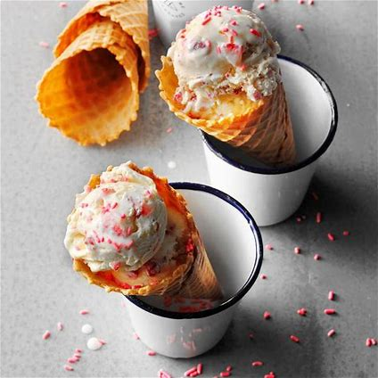
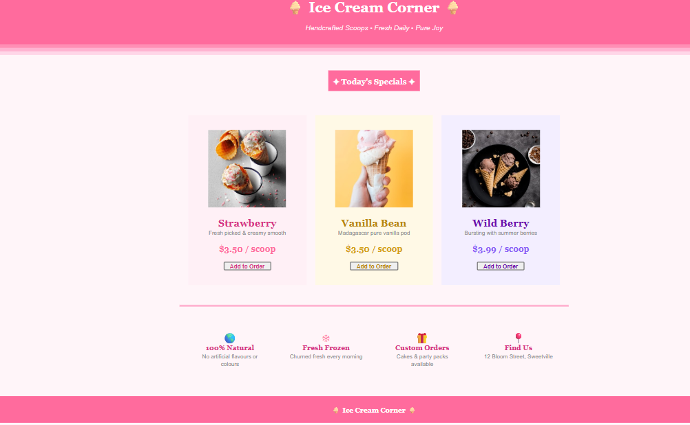

# 🍨 Ice Cream Corner – Simple Product Page (HTML Project)

## 📌 About the Project

**Ice Cream Corner** is a simple product showcase webpage built using **pure HTML**.

The page displays an **ice cream shop layout** where different flavors are presented with images, descriptions, prices, and order buttons.

This project helps beginners understand how **basic HTML tags, tables, images, and text formatting** can be used to create a visually organized webpage **without using CSS or JavaScript**.

---

# 🎯 Learning Objectives

After completing this project, students will learn how to:

* Structure a webpage using **HTML**
* Create layouts using **tables**
* Display **images inside webpages**
* Add **icons and emojis**
* Format text using **HTML tags**
* Create a **simple product card layout**

---

# 🧰 HTML Tags Used in This Project

| Icon | HTML Tag   | Description                                   |
| ---- | ---------- | --------------------------------------------- |
| 🧱   | `<html>`   | Defines the root element of the HTML document |
| 🎨   | `<body>`   | Contains all visible webpage content          |
| 📊   | `<table>`  | Used to structure and design the page layout  |
| 📏   | `<tr>`     | Creates rows inside tables                    |
| 📦   | `<td>`     | Creates columns or cells inside tables        |
| 🖼   | ``    | Displays images in the webpage                |
| 🔤   | `<font>`   | Changes text color, font style, and size      |
| 🔘   | `<button>` | Creates clickable buttons                     |
| ➖    | `<hr>`     | Adds horizontal divider lines                 |
| ↩    | `<br>`     | Adds spacing between elements                 |

---

# 🎨 Page Sections Explained

## 1️⃣ Header Section

The header displays the **store title and tagline**.

Example in code:

```html
<table width="100%" bgcolor="#FF6B9D">
```

Features included:

* Store name **Ice Cream Corner**
* Decorative emoji icons 🍨
* Tagline describing the store

Example display:

```
🍨 Ice Cream Corner 🍨
Handcrafted Scoops • Fresh Daily • Pure Joy
```

---

# 2️⃣ Decorative Color Stripes

Below the header, small color stripes are created using table rows.

Example code:

```html
<td bgcolor="#FF8FB5" height="8"></td>
```

Purpose:

* Improves visual design
* Separates header from the product section

---

# 3️⃣ Today's Specials Section

This section highlights **featured ice cream flavors**.

Example heading:

```
✦ Today's Specials ✦
```

This works as a **section title for the product cards**.

---

# 4️⃣ Ice Cream Product Cards

Each ice cream flavor is displayed inside a **table card layout**.

Each card contains:

* Product Image
* Flavor Name
* Short Description
* Price
* Order Button

Example flavors in this project:

🍓 Strawberry
🍦 Vanilla Bean
🫐 Wild Berry

Example structure:

```
Image
Flavor Name
Description
Price
Add to Order Button
```

---

# 🖼 How Images Are Added

Images are displayed using the **HTML `` tag**.

Example code:

```html

```

### Explanation

| Part    | Meaning                 |
| ------- | ----------------------- |
| `src`   | Location of the image   |
| `width` | Controls the image size |
| `alt`   | Describes the image     |

---

# 📂 Step-by-Step Image Setup

### Step 1 — Create Image Folder

Create a folder named **Images** inside **wwwroot**.

Project structure:

```
IceCreamCorner
│
├── index.html
│
└── wwwroot
     └── Images
          ├── Strawberry.png
          ├── Vanilla Bean.png
          └── Wild Berry.png
```

---

### Step 2 — Add Image Path in HTML

Example:

```html

```

This tells the browser to load the image from the **Images folder**.

---

# 🔘 Order Button Section

Each product card includes an **Add to Order button**.

Example code:

```html
<button>Add to Order</button>
```

Purpose:

* Represents a **product purchase option**
* Makes the product card interactive

---

# ℹ️ Store Information Section

This section highlights important features of the store.

Example features included:

🌍 **100% Natural** – No artificial flavors
❄ **Fresh Frozen** – Churned every morning
🎁 **Custom Orders** – Ice cream cakes available
📍 **Find Us** – Store location information

Icons are added using **HTML emoji codes**.

Example:

```html
<font size="5">&#127758;</font>
```

---

# 🧾 Footer Section

The footer appears at the bottom of the webpage.

Example display:

```
🍨 Ice Cream Corner 🍨
```

Purpose:

* Branding
* End section of the webpage

---

# 📸 Output

Below is the preview of the **Ice Cream Corner webpage**.



> Save a screenshot of your webpage as **output.png** and place it in the project folder.

---

# 📂 Project Folder Structure

```
IceCreamCorner
│
├── index.html
├── README.md
├── output.png
│
└── wwwroot
     └── Images
          ├── Strawberry.png
          ├── Vanilla Bean.png
          └── Wild Berry.png
```

---

# 💡 Purpose of This Project

The purpose of this project is to help **beginner developers understand how HTML works by creating a simple product page**.

Students learn how to:

* Build a webpage using **basic HTML**
* Use **tables to design layouts**
* Add **images and product details**
* Display **prices and buttons**
* Organize webpage sections like **header, product cards, and footer**

This project focuses on **learning HTML fundamentals before moving to CSS or JavaScript**.

---

# 📚 Skills Practiced

* HTML Page Structure
* Table Layout Design
* Image Integration
* Text Formatting
* Product Card Design
* Basic Web UI Creation

---

# 📜 License

This project is created for **educational and learning purposes**.

Students are encouraged to:

* Add more ice cream flavors
* Change colors
* Add more sections
* Improve the design

---
## 📸 Output


## 💡 Purpose of This Project
# 👨‍💻 Author

Created as a **Beginner HTML Practice Project**
For students learning **Web Development Fundamentals**.
