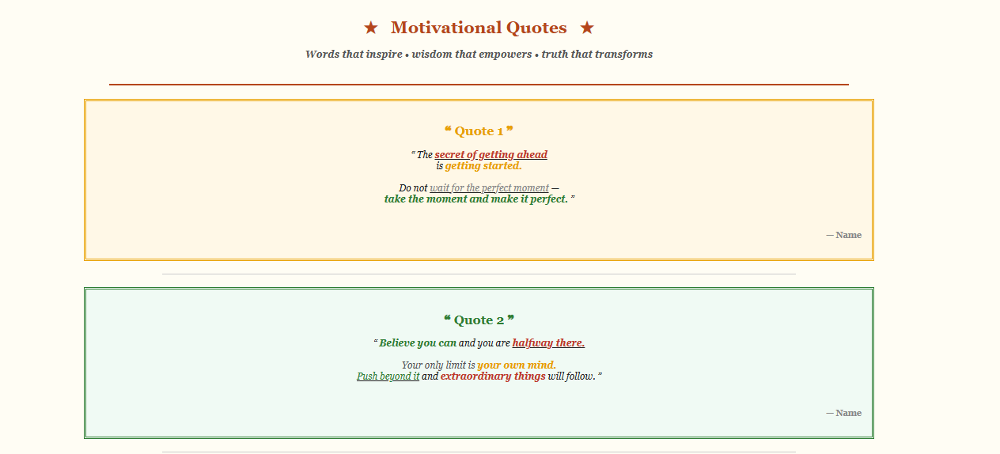

# 02 HTML Text Formatting – Motivational Quotes Page

## ✨ What is Text Formatting?

**Text formatting** in HTML means changing the appearance of text to make it more readable and visually attractive.
It includes making text **bold, italic, underlined, colored, or structured** using HTML formatting tags.

---

## 📖 About This Project

This project is created for **beginner learners to practice HTML text formatting and basic webpage design**.

It is a **Motivational Quotes Web Page** built using **only pure HTML**.
The page displays inspirational quotes using different **text formatting tags, colors, and structured layout**.

There is:

❌ No CSS
❌ No JavaScript
❌ No Bootstrap
❌ No Backend

The goal of this project is to help beginners understand how **HTML text formatting and simple layout elements** can be used to design an attractive webpage.

---

## 🎯 Learning Objectives

After completing this project, learners will understand:

* HTML page structure
* Text formatting using `<b>`, `<i>`, and `<u>`
* Changing text color using `<font>`
* Creating page sections using `<hr>`
* Aligning content using `align`
* Creating structured layouts using `<table>`
* Adding spacing using `<br>`
* Organizing content with headings and paragraphs

---

## 🖥 Full Design Information

This project includes a **motivational quotes webpage layout** with the following elements:

* Page heading with decorative symbols
* Subtitle describing the theme
* Multiple quote sections
* Each quote displayed inside a structured table layout
* Highlighted keywords with different colors
* Quote author section
* Footer message

The design demonstrates how **HTML formatting tags and tables can be used to structure content visually without CSS**.

---

## 🏷 HTML Tags Used and Their Purpose

| Icon   | Tag              | Purpose                               |
| ------ | ---------------- | ------------------------------------- |
| 🧱     | `<html>`         | Root element of the HTML page         |
| 🧠     | `<head>`         | Contains metadata and title           |
| 🏷     | `<title>`        | Displays page title in browser tab    |
| 📄     | `<body>`         | Contains all visible webpage content  |
| 🔠     | `<h1> <h2> <h3>` | Headings used for titles and sections |
| 📝     | `<p>`            | Defines paragraph text                |
| **𝐁** | `<b>`            | Makes text bold                       |
| *𝑰*   | `<i>`            | Makes text italic                     |
| 🔽     | `<u>`            | Underlines text                       |
| 🎨     | `<font>`         | Changes text color, size, and font    |
| 📦     | `<table>`        | Creates layout container              |
| 📏     | `<tr>`           | Table row                             |
| 📑     | `<td>`           | Table cell                            |
| ➖      | `<hr>`           | Creates horizontal line               |
| ↩      | `<br>`           | Adds spacing or line break            |

---

## 🚀 How to Run This HTML Page

1. Open **Visual Studio** or **Visual Studio Code**.
2. Create a new HTML file named:

```
index.html
```

3. create the HTML code into the file.
4. Save the file.
5. Double-click the file or open it in your browser.

The webpage will display the ** Design Page**.

---

## 📸 Output




## 💡 Purpose of This Project

This project helps beginners practice **HTML text formatting, page structuring, and content presentation** using only basic HTML tags without any styling frameworks.
