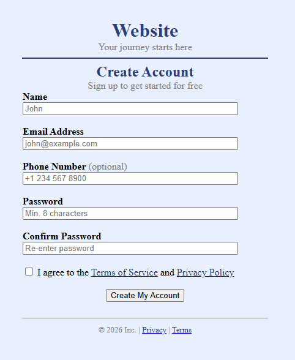

# 01BasicHtml
Create Account Form – HTML Beginner Project
📘 About This Project

This project is created for beginner learners to practice basic HTML design.

It is a simple Create Account (Signup) Form made using only HTML.

There is no CSS, no JavaScript, and no backend.

The purpose of this project is to understand how basic webpage structure and form design works using pure HTML.

🎯 Learning Objective

After completing this project, learners will understand:

HTML page structure

Head and Body tags

Form creation

Different input types

Background color in HTML using bgcolor

Text formatting using 

Content alignment using align attribute

Basic webpage layout structure

🖥 Full Design Information

This project includes a complete basic form design structure:

Page title

Background color

Center aligned content

Website heading section

Account creation form

Multiple input fields

Checkbox for terms agreement

Submit button

Footer section

Proper spacing using line breaks

It represents a fully structured beginner-level webpage using only HTML elements.

🏷 HTML Tags Used and Their Purpose
Tag	Purpose
<html>	Root element of the HTML page
<head>	Contains page title and metadata
<title>	Sets the title shown in browser tab
<body>	Contains all visible content

	Groups and organizes content
	Styles text color and size (basic method)
<h1>	Main heading
<h2>	Sub heading
<form>	Creates a form section
<input>	Creates input fields (text, email, password, tel, checkbox, submit)
<a>	Creates hyperlinks

	Creates horizontal line
 	Adds spacing using line break
🚀 How to Add and Run HTML Page Using Visual Studio

Open Visual Studio and open your project.

In Solution Explorer, right click on the project name.

Click Add → New Item → HTML Page.

Name the file Registration.html and click Add.

Paste your HTML code and click Save.

Right click the project and select Open Folder in File Explorer.

Double click Registration.html to open it in your browser.

📸 Output
## 📸 Output

💡 Purpose

This project is fully designed using only basic HTML elements for learning and practice.